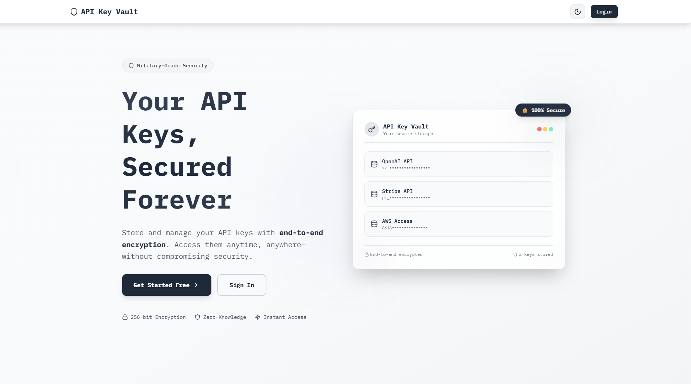
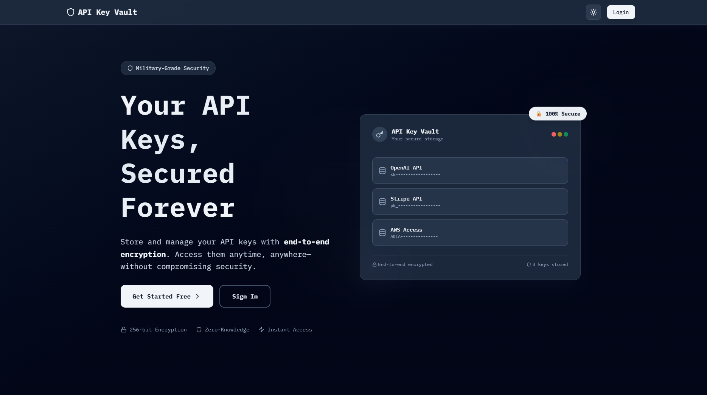

# API Key Vault

  **Secure storage for your API keys with military-grade encryption**

  
  
  
  

##  Screenshots

  <table>
    <tr>
      <td width="50%">
        
        
<em>Light Mode</em>

      </td>
      <td width="50%">
        
        
<em>Dark Mode</em>

      </td>
    </tr>
  </table>

---

##  Overview

API Key Vault is a modern web application that allows developers to securely store, retrieve, and manage their API keys with **end-to-end encryption**. Built with the latest technologies, it provides a seamless experience for keeping your sensitive credentials safe while making them easily accessible when needed.

##  Features

-  **End-to-End Encryption** - API keys are encrypted using libsodium (NaCl) before storage
-  **Easy Key Management** - Store, retrieve, and organize all your API keys in one place
-  **User Authentication** - Secure authentication powered by Supabase Auth
-  **Row-Level Security** - Database-enforced access control with RLS policies
-  **Dark Mode Support** - Beautiful UI that adapts to your preference
-  **Responsive Design** - Works seamlessly on desktop, tablet, and mobile
-  **Fast & Modern** - Built with Next.js 15 and React 19
-  **Zero-Knowledge Architecture** - Your keys are encrypted client-side

##  Technology Stack

### Frontend
- **React 19** - Latest React features and performance
- **Next.js 15** - Server-side rendering and API routes
- **TypeScript** - Type-safe development
- **Tailwind CSS 4** - Modern utility-first styling
- **Lucide React** - Beautiful icon library

### Backend
- **Next.js API Routes** - Serverless backend functions
- **Supabase** - PostgreSQL database and authentication
- **libsodium** - Industry-standard encryption (NaCl)
- **Row-Level Security** - Database-level access control

### Database
- **PostgreSQL** (via Supabase) - Relational database
- **RLS Policies** - Secure data isolation per user

##  Security Features

### Encryption
- **Algorithm**: XSalsa20-Poly1305 (via libsodium)
- **Key Size**: 256-bit encryption keys
- **Nonce**: Random 24-byte nonce per encryption
- **AEAD**: Authenticated encryption prevents tampering

### Database Security
- **Row-Level Security (RLS)** - Users can only access their own data
- **Foreign Key Constraints** - Data integrity enforced at database level
- **Secure Authentication** - Powered by Supabase Auth with JWT tokens

### Best Practices
- Encryption keys stored separately from encrypted data
- API keys never stored in plaintext
- Server-side token verification on all protected routes
- HTTPS required in production

##  Usage

### Web Interface

1. **Sign Up / Login** - Create an account or sign in
2. **Store a Key** - Navigate to "Store Keys" and add your API key with a descriptive name
3. **View Keys** - Access your stored keys from the "Vault" page
4. **Copy Keys** - Click to reveal and copy keys when needed
5. **Manage Profile** - View analytics and manage your account

##  Contributing

Contributions are welcome! Please feel free to submit a Pull Request.

##  License
This project is licensed under the MIT License - see the [LICENSE](LICENSE) file for details.

##  Acknowledgments

- [Supabase](https://supabase.com/) - Backend infrastructure and authentication
- [Next.js](https://nextjs.org/) - React framework
- [Tailwind CSS](https://tailwindcss.com/) - Styling framework
- [libsodium](https://libsodium.gitbook.io/) - Encryption library

---

  Made with ❤️ by developers, for developers

